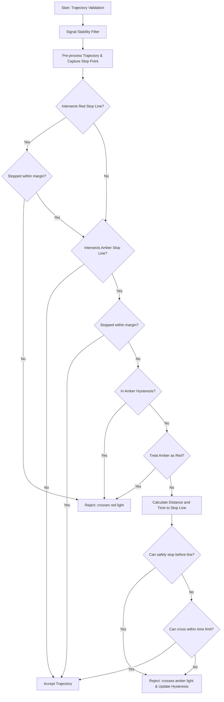

# Traffic Light Filter

## Purpose/Role

This filter rejects trajectories if they are found to run through a red or amber traffic light. It ensures that the planned motion adheres to traffic signals by validating that the vehicle does not cross stop lines when the signal is prohibitive, while accounting for the "dilemma zone" during amber lights and allowing for a configurable stopping margin.

Additionally, this filter includes signal stability filtering to prevent reacting to flickering or transient signal detections, and amber hysteresis tracking to ensure consistent rejection once an amber light has been deemed "stoppable."

## Algorithm Overview

The filter decides whether to reject a trajectory based on the following steps:

1. **Signal Pre-filtering (Stability)**:
   - Tracks the duration each traffic light has been in its current state.
   - If the ego vehicle is moving ($v \ge v_{stopped\_threshold}$):
     - A RED signal is ignored (treated as inactive) until it has been stable for `stable_duration_threshold_red`.
     - An AMBER signal is ignored until it has been stable for `stable_duration_threshold_amber`.
   - If the ego vehicle is stopped ($v < v_{stopped\_threshold}$), signals are used immediately to allow for responsive departures.
2. **Trajectory Pre-processing**:
   - Filters out points behind the ego vehicle.
   - Trims the trajectory at the first point where velocity is zero or negative (stop point).
   - Captures this stop point if it exists within the checked range.
   - Extends the trajectory's visual representation by the vehicle's longitudinal offset (front of the vehicle) to ensure the front bumper is checked against stop lines.
3. **Stop Line Identification**:
   - Uses the **Route** to map traffic light signals to lanelets and filters out signals that do not apply to the current route.
   - For each relevant traffic light, it verifies if the signal is a stop signal for the associated lanelet.
   - Retrieves red and amber stop lines for these relevant signals.
   - If `treat_amber_light_as_red_light` is enabled, all amber stop lines are treated as red stop lines.
4. **Red Light Validation**:
   - If the trajectory intersects a red stop line:
     - If a stop point exists and its distance to the stop line is within `stop_overshoot_margin`, the trajectory is accepted (considered as "stopped at the line").
     - Otherwise, the trajectory is rejected.
5. **Amber Light Validation**:
   - If the trajectory crosses an amber stop line:
     - If a stop point exists and its distance to the stop line is within `stop_overshoot_margin`, the trajectory is accepted.
     - If the signal ID is currently in the **Amber Hysteresis** state (was rejected within the last `amber_rejection_hysteresis_duration` and ego is not stopped), the trajectory is rejected.
     - Otherwise, the filter calculates the distance to the intersection and the time at which the ego vehicle is expected to cross it.
     - It then applies the [Amber Light Logic](#amber-light-logic) to determine if the crossing is permissible.
     - If rejected, the signal ID is added to the hysteresis history.

### Decision Flow

### Amber Light Logic

The logic for amber lights handles the "dilemma zone" where a vehicle might be too close to stop safely but needs to clear the intersection. The filter uses the `can_pass_amber_light` function:

1. **Stopping Distance ($D_{stop}$)**: Calculated using current velocity, acceleration, and configured limits (`deceleration_limit`, `jerk_limit`, `delay_response_time`).
2. **Stop Check**: If $D_{stop} \le \text{Distance to Stop Line}$, the vehicle is considered able to stop safely. In this case, crossing the amber light is **rejected**.
3. **Passing Check**: If the vehicle cannot stop safely, it checks if it can clear the stop line within a `crossing_time_limit`. If it can, the trajectory is **accepted**.
4. **Final Decision**: A trajectory is only accepted through an amber light if the vehicle **cannot** safely stop AND **can** cross within the time limit.

## Interface

### Context

The filter utilizes the following data from the `FilterContext`:

- **Lanelet Map**: Used to find regulatory elements (traffic lights) and their associated stop lines.
- **Traffic Light Signals**: Provides the current state (color) of traffic light groups.
- **Route**: Used to map traffic light signals to lanelets and filter those that are relevant to the vehicle's path.
- **Vehicle Info**: Used to account for the vehicle's dimensions (longitudinal offset) when checking for stop line intersections.
- **Odometry**: Provides the current velocity to determine if ego is stopped and to calculate stopping distances.

### Parameters

| Parameter name                                               | Type   | Default | Description                                                                                                       |
| ------------------------------------------------------------ | ------ | ------- | ----------------------------------------------------------------------------------------------------------------- |
| `traffic_light.deceleration_limit`                           | double | 2.8     | [m/s²] Deceleration limit used to estimate the minimum stopping distance at an amber light.                       |
| `traffic_light.jerk_limit`                                   | double | 5.0     | [m/s³] Jerk limit used to estimate the minimum stopping distance at an amber light.                               |
| `traffic_light.delay_response_time`                          | double | 0.5     | [s] Delay response time added to the stopping distance calculation.                                               |
| `traffic_light.crossing_time_limit`                          | double | 2.75    | [s] Maximum time allowed for the ego vehicle to cross the stop line after an amber light appears.                 |
| `traffic_light.treat_amber_light_as_red_light`               | bool   | true    | When true, amber lights are treated identically to red lights (rejection on intersection regardless of distance). |
| `traffic_light.treat_unknown_light_as_red_light`             | bool   | false   | When true, unknown lights are treated identically to red lights (rejection on intersection).                      |
| `traffic_light.stop_overshoot_margin`                        | double | 0.5     | [m] Maximum distance between the stop line and the trajectory stop point to consider the trajectory feasible.     |
| `traffic_light.stable_duration_threshold_red`                | double | 0.0     | [s] Minimum duration a RED light must be seen before it is considered active (only when ego is moving).           |
| `traffic_light.stable_duration_threshold_amber`              | double | 0.0     | [s] Minimum duration an AMBER light must be seen before it is considered active (only when ego is moving).        |
| `traffic_light.amber_rejection_hysteresis_duration`          | double | 0.0     | [s] Duration to persist an amber rejection state to prevent "flipping" due to minor velocity/distance changes.    |
| `traffic_light.ego_stopped_velocity_threshold`               | double | 0.01    | [m/s] Velocity threshold below which stability and hysteresis filters are bypassed.                               |
| `traffic_light.checked_trajectory_length.deceleration_limit` | double | 2.0     | [m/s²] Deceleration limit used to calculate the maximum trajectory length to check for traffic lights.            |
| `traffic_light.checked_trajectory_length.jerk_limit`         | double | 4.0     | [m/s³] Jerk limit used to calculate the maximum trajectory length to check for traffic lights.                    |

## Logging and Visualization

The `TrafficLightFilter` provides debug markers to visualize which traffic lights caused trajectory rejections. These markers are aggregated across all candidate trajectories evaluated within a single processing frame.

### Debug Markers

For each traffic light that causes at least one trajectory rejection, a `TEXT_VIEW_FACING` marker is generated at the position of the traffic light's stop line.

The marker text contains:

- **TL ID**: The unique identifier of the traffic light (regulatory element).
- **Signal**: The current signal state as interpreted by the filter (e.g., `red`, `amber`, `amber as red`, `unknown as amber`).
- **Rejections**: The total number of trajectories that were rejected due to this specific traffic light in the current frame.

